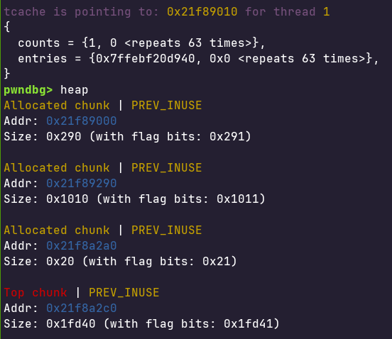
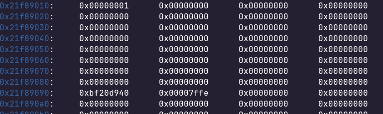
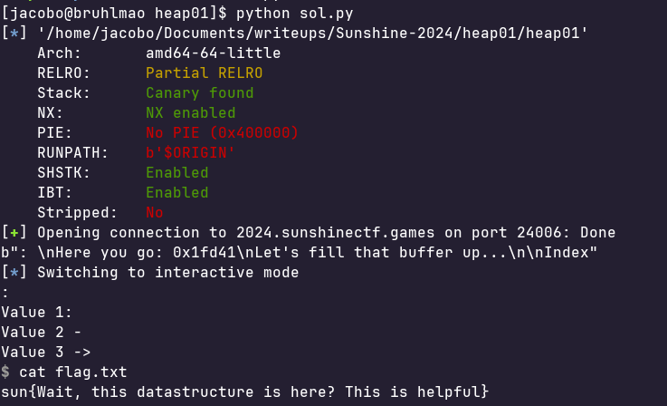

## Intro:
This is a heap challenge where you are asked a size to malloc a chunk. (It is important to note that malloc is called twice in this program)
You are allowed to write to any address relative to this chunk you are given. 
You can either index forwards or backwards. 

My solution took advantage of the tcache which is stored in the first allocated heap chunk. 
The idea is to index backwards far enough to write into the tcache entries and and counts. 
Where the entry will be the return address. Counts will only be written to so signify that there is a tcache entry.
After the entry is written to the next time we do a malloc it will return the return address.

## Decomp
Here is a decompilation of the program that only includes the relevant functions 

```
int64_t win()
{
    void* fsbase;
    int64_t rax = *(fsbase + 0x28);
    system("/bin/sh");
    
    if (rax == *(fsbase + 0x28))
        return (rax - *(fsbase + 0x28));
    
    __stack_chk_fail();
    /* no return */
}

int64_t func0()
{
    void* fsbase;
    int64_t rax = *(fsbase + 0x28);
    puts("Do you want a leak? ");
    int64_t var_50 = get_inp();
    void var_28;
    printf(&data_402025, &var_28);
    puts("Enter chunk size: ");
    int64_t bytes = get_inp();
    void* rax_4 = malloc(bytes);
    printf("Here you go: 0x%lx\n", *(rax_4 + 0x18));
    puts("Let's fill that buffer up...\n");
    puts("Index: ");
    int64_t rax_9 = get_inp();
    puts("Value: ");
    *((rax_9 << 3) + rax_4) = get_inp();
    puts("The chunk is still hungry... let…");
    puts("Index: ");
    int64_t rax_14 = get_inp();
    puts("Value: ");
    *((rax_14 << 3) + rax_4) = get_inp();
    int64_t* rax_20 = malloc(bytes);
    puts("Value 1: ");
    *rax_20 = get_inp();
    puts("Value 2 - ");
    rax_20[1] = get_inp();
    puts("Value 3 -> ");
    rax_20[2] = get_inp();
    
    if (rax == *(fsbase + 0x28))
        return (rax - *(fsbase + 0x28));
    
    __stack_chk_fail();
    /* no return */
}

int32_t main(int32_t argc, char** argv, char** envp)
{
    void* fsbase;
    int64_t rax = *(fsbase + 0x28);
    puts("\nWelcome to Heap Land - where a…");
    func0();
    
    if (rax == *(fsbase + 0x28))
        return (rax - *(fsbase + 0x28));
    
    __stack_chk_fail();
    /* no return */
}

```

As you can see we have a win function, so the goal is to return to the win function.

```
    void* rax_4 = malloc(bytes);
    printf("Here you go: 0x%lx\n", *(rax_4 + 0x18));
    puts("Let's fill that buffer up...\n");
    puts("Index: ");
    int64_t rax_9 = get_inp();
    puts("Value: ");
    *((rax_9 << 3) + rax_4) = get_inp();
    puts("The chunk is still hungry... let…");
    puts("Index: ");
    int64_t rax_14 = get_inp();
    puts("Value: ");
    *((rax_14 << 3) + rax_4) = get_inp();
    int64_t* rax_20 = malloc(bytes);
```

## TCache
We can also see that we have 2 chances at input before we call into the next malloc, which means that we can write to the tcache entry and the tcache count 
in time for the next malloc and have it return an arbitrary address that we can write to.




If we take a look at gdb we can see that our allocated chunk is at 0x21f8a2a0 (size 0x20), we know this because we 
allocated 0x10 size and malloc also adds about 0x10 for metadata like previous size and chunk size. We also know that
0x21f89000 is the base of the heap and from the image we can see that the tcache counts start at 0x21f89010 and the tcache 
entries start at 0x21f89090 after some trial and error.

So first we do some math to figure out the negative offsets we need (note that i am using 0x21f8a2b0 because the data region we are
pivoting from starts at 0x21f8a2a0 + 0x10) 


```
#these are negative offsets since we are going backwards into the heap
tcache count offset = (0x21f8a2b0(our address) - 0x21f89010(tcache count address)) / 8 = 0x254 
tcache entry offset = (0x254 - ((0x21f89090 - 0x21f89010) / 8))  = 0x244
```

Now that we know where to write to manipulate the tcache we can trick the program into mallocing the return address
which we can calculate from the address we are given when we begin the program.

From there we just send the address of the win function as there is no pie.

A quick note is that we need to do win + 5 due to stack allignment issues.

##flag 



