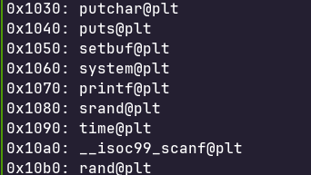
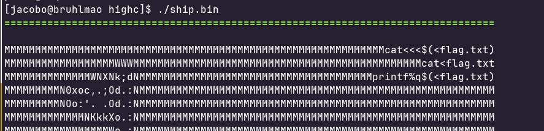
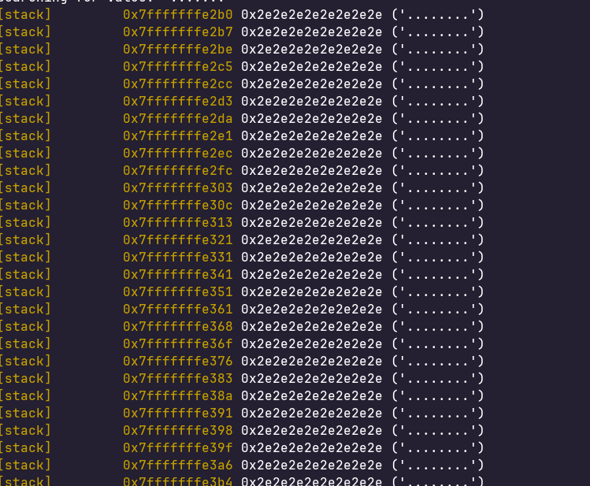
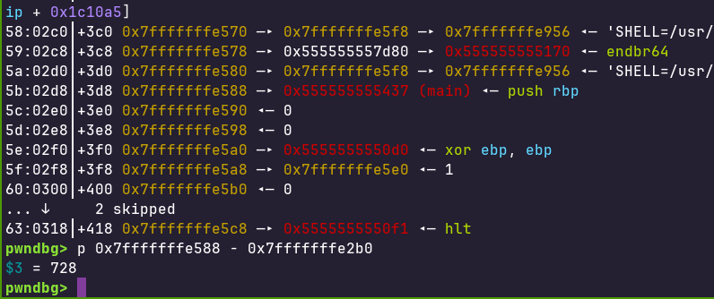
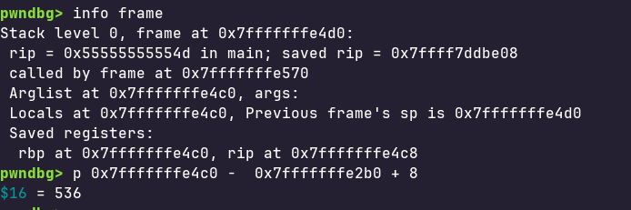
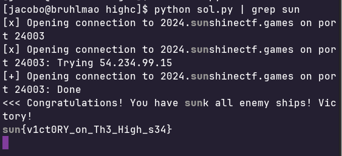

## Intro 
This is a program that plays like battleship, the only thing is that for some reason
we are allowed to choose address that are out of bounds. Which allows for arbitrary read
and arbitrary write. 

## Scouting

Looking at the initial output we can see that there is a string "cat<flag.txt" in the binary, we can also see that
we have system in the plt. This means that can effectively call system("cat<flag.txt") and grab the flag.
Another thing to note is that when we go out of bounds we leak a byte in hex at [enemy array address + offset].
Which allows us to arbitrarily read. As we can see we put an offset of 300 in this example which should be somewhere in our
board and the hex printed out what 2e which is "." in ascii. Which matches up with what we have on our board. (note that the
enemy array is located before our array which is why I can do offset 300 and hit my array). 

## The leak 

#
Knowing we can arbitrarily read any byte we can locate an offset where an address resides. I ended up finding the address of main
by using an offset of 728 which I found by going into gdb and finding the base address of the enemy ship, and looking into the stack to see 
how far it was from main after both my board and the enemy board were initialized. Quick note, because we know that the enemy board is filled with
"...." we can search for "..." in gdb to find the base address of the enemy board. If we look at the image we can see that the enemy board begins at 0x7fffffffe2b0.

We can also see that there is an address to main at 0x7fffffffe588. So when we subtract these 2 values we end up with an offset of 728 and we now have the address of main.
This allows us to calculate the address of system.plt and the address of "cat<flag.txt" and any gadgets we might need for stack allignment reasons. 

## The write

The arbitrary read we first reads the byte at the address and then writes the "missile" value into that byte.
Luckily we are allowed to launch a custom missle which lets us write any byte at any place. So this means all we have to do 
is find the offset to the return address from the enemy board. The only way to get to a return address is by either losing or winning.
To find the address of the return address I knew that the return address is + 8 from the rbp so I did (rbp - enemy board address + 8).
And ended up with 536 for my offset.

## Rop + win

Knowing this I now just arbitrarily wrote a rop chain that would pop "cat<flag.txt" into rdi then called into system.
I got pop rdi's offset from the ropgadget command line tool, however you can probably get this from using pwntools rop tool.
Now we have the flag

